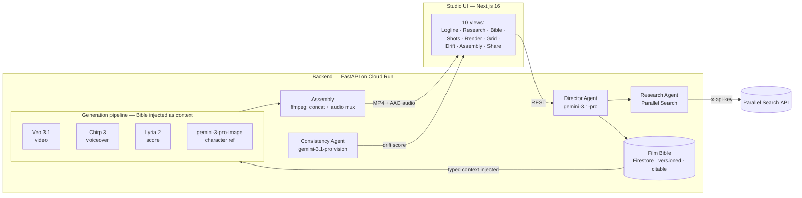

# Auteur — The Film Bible Agent

> **AI cinema's memory. Grounded in reality. Consistent across every shot.**

[](./LICENSE)
[](https://fastapi.tiangolo.com/)
[](https://nextjs.org/)
[](https://cloud.google.com/run)
[](https://youtu.be/iVlglr66YXw)

<p align="center">
  <a href="https://youtu.be/iVlglr66YXw">▶ Watch 3-min demo</a>
  &nbsp;·&nbsp;
  <a href="https://auteur-app-jbkbgthudq-uc.a.run.app"><strong>Try live studio →</strong></a>
  &nbsp;·&nbsp;
  <a href="https://github.com/sodiq-code/auteur">View code</a>
</p>

---

## The problem

Veo 3.1 produces gorgeous individual clips. But every shot is an isolated lottery. Characters drift. Wardrobes mutate. Voices lose continuity. Four generation calls produce four clips that look like four different films — not one.

## The one idea

A persistent, typed, versioned **Film Bible** that is injected as structured context into every generation call. Consistency is enforced by the architecture, not requested by the prompt.

## The magic

```
Logline
  ↓
Research ──→ Parallel Search (runtime, visible in UI)
  ↓
Film Bible (typed, versioned, citable)
  ↓
Generate ───→ Veo 3.1 + Chirp 3 + Lyria 2 (Bible injected as context)
  ↓
Consistency Check ──→ Gemini 3.1 Pro Vision (drift score 0.0–1.0)
  ├── PASS → next shot
  └── DRIFT → regenerate with drift report as corrective context
  ↓
Assemble ───→ ffmpeg: concat + mux voiceover/score → final MP4
```

The loop is what makes this an agentic system: the Consistency Check Agent's drift score feeds back into re-generation decisions, and drift is tracked across re-generations per shot.

## The result

| Shot | Scene | Face | Age | Beard | Wardrobe | **Overall** |
|------|-------|------|-----|-------|----------|------------|
| 1 | Lamp Room (interior, dusk) | 0.95 | 0.95 | 0.95 | 0.95 | **0.95** |
| 2 | Rocks (coastal, dawn) | 0.80 | 0.90 | 0.90 | 0.90 | **0.85** |
| 3 | Interior (candlelight) | 0.95 | 0.95 | 0.95 | 0.95 | **0.95** |
| 4 | Exterior (balcony, storm) | 0.95 | 0.95 | 0.95 | 0.95 | **0.95** |

**Mean model-evaluated overall score: 0.925 · Verdict: GO** (drift threshold 0.25)

One Film Bible. Four generations. One coherent character. Full evidence in [`docs/validation-report.md`](./docs/validation-report.md).

<p align="center">
  
</p>

> **Methodology:** Consistency scores are model-based evaluation signals produced by the Consistency Check Agent (`gemini-3.1-pro-preview` vision) using a fixed rubric across four diagnostic dimensions: face identity, age appearance, facial hair, and wardrobe. The evaluator also produces an independent holistic `overall` score in the same structured response; it is intentionally **not** calculated as the mean of the component scores. The component scores diagnose specific sources of drift, while `overall` represents the evaluator's holistic consistency judgment. These are internal LLM-as-judge metrics, not claims of objective perceptual similarity or ground-truth identity matching. Because the Consistency Check Agent shares the Google model ecosystem with the generation pipeline, its scores should be interpreted as operational consistency signals rather than independent ground-truth measurements. **Drift = 1.0 − overall.** Auteur accepts a shot when `overall ≥ 0.75`; this threshold is an engineering operating threshold for the prototype, not a statistically validated perceptual-quality boundary.

### A real before/after

Captured on the deployed backend via `POST /regenerate` with `use_drift_correction=true`. Shot 2 (Rocks, coastal dawn) scored the lowest overall (0.85) in the initial generation. The regeneration received the Bible **plus** the prior drift report as corrective context:

```
SHOT 2 — FIRST GENERATION (Bible only)
  face_identity: 0.80   age_appearance: 0.90   beard: 0.90   wardrobe: 0.90
  overall: 0.85   drift: 0.15   verdict: ACCEPT

        │  POST /regenerate  (drift report → corrective context → Veo)

        ▼
SHOT 2 — REGENERATION (Bible + drift diagnosis)
  face_identity: 0.90   age_appearance: 0.95   beard: 0.95   wardrobe: 0.90
  overall: 0.90   drift: 0.10   verdict: ACCEPT
```

Face identity improved 0.80 → 0.90, age 0.90 → 0.95, beard 0.90 → 0.95. Full evidence in [`docs/regeneration-evidence.json`](./docs/regeneration-evidence.json).

---

## Why Parallel

Generative filmmaking has two memory problems. Auteur solves both.

| Memory problem | Question | Solved by |
|----------------|----------|-----------|
| **Creative memory** | What must remain consistent across the film? | The **Film Bible** (typed, versioned, injected) |
| **World memory** | What should the film know about reality? | **Parallel Search** (runtime, visible, cached) |

Parallel is called at runtime by the Research Agent to ground every creative decision (era, location, fashion, slang, music, lighting) in real-world references. The call site is visible in the live Research panel — every query and result streams in real time. If Parallel is unavailable, the Research Agent logs the failure, returns empty refs, and the Director synthesizes the Bible from the logline alone. Verified by `backend/tests/test_fallback_no_parallel_key.py`.

---

## The agent architecture

Three agents on Google Agent Development Kit, with a 6-layer memory architecture.

| Agent | Model | Role |
|-------|-------|------|
| Director | `gemini-3.1-pro-preview` | Orchestrator. Logline in, plans the pipeline, delegates to Research and Consistency, writes the Bible, generates the shot list. |
| Research | `gemini-3.1-pro-preview` | Calls Parallel Search at runtime, synthesizes typed `Reference` objects. Read-only. |
| Consistency Check | `gemini-3.1-pro-preview` (vision) | Extracts a frame from each Veo clip, scores drift against the character reference, produces an accept/re-generate recommendation. |

| Memory layer | Store | Content |
|--------------|-------|---------|
| L1 Working | In-process | Current tool-call args + last 5 tool results |
| L2 Project state | Firestore `projects/{id}` | Project, Bible, shots, generation log |
| L3 Bible versions | Firestore `bibles/{projectId}_{version}` | Immutable snapshots — every edit creates a new version |
| L4 Search cache | Firestore `search_cache/{projectId}_{queryHash}` | Parallel Search results, 24h TTL |
| L5 Rendered artifacts | Cloud Storage | Veo MP4s, Chirp WAVs, Lyria WAVs, character-ref PNGs |
| L6 Drift history | Firestore | Per-shot drift scores across re-generations |

The Director selects among 6 external tools (Parallel Search, Veo, Chirp, Lyria, Imagen, Gemini Vision) and 3 internal tools (`build_bible`, `generate_shot_list`, `assemble_film`) to move a logline through the full pipeline.

## The studio interface

Ten views map to the filmmaking workflow: **Logline → Research → Bible → Shots → Render → Grid → Drift → Assembly → Share**. The Bible is visible and editable at every step. The signature moment is the **SideBySide** component: one character reference + four generated shot frames, each with its consistency score. A command palette (⌘K) navigates the workflow.

---

## Architecture



See [`ARCHITECTURE.md`](./ARCHITECTURE.md) for the full component justification.

---

## The Film Bible

The Bible is a typed Pydantic model persisted as an immutable, versioned snapshot in Firestore. Every generation call cites the Bible version it was built from.

| Collection | Captures |
|------------|----------|
| `characters` | Name, age, description, voice profile, wardrobe, reference image |
| `locations` | Name, era, description, grounding references |
| `wardrobes` | Garment, fabric, color per character |
| `voice_profiles` | Voice model, voice name, description per character |
| `score_motifs` | Prompt, instrument, mood |
| `style_anchors` | Color grade, aspect ratio, photographic aesthetic, mood |
| `story_beats` | Ordered narrative beats — the shot list is derived from these |

Each Bible is an append-only snapshot. Editing a field creates a new version (`bible_v1` → `bible_v2`); the previous version is immutable.

---

## Stack

| Layer | Choice | Why |
|-------|--------|-----|
| LLM (orchestration + vision) | `gemini-3.1-pro-preview` via Vertex AI (global region) | Orchestration, Bible synthesis, and vision-based consistency evaluation |
| Agent framework | Google Agent Development Kit (ADK) | Agent orchestration primitives |
| Video | Veo 3.1 (`veo-3.1-fast-generate-001`) | ASSET reference images for cross-shot character consistency |
| Voice | Chirp 3 (`gemini-3.1-flash-tts-preview`) | Prebuilt voices; 24kHz PCM output |
| Music | Lyria 2 (`lyria-002`) | Cinematic score generation |
| Image | `gemini-3-pro-image` (global region) | Character reference generation |
| Persistence | Firestore | Serverless, schema-flexible, sync client |
| Object storage | Cloud Storage | Rendered MP4s, WAVs, PNGs |
| Deployment | Cloud Run (min 1, max 10) | Always-warm, autoscaling |
| Partner integration | Parallel Search API | Runtime world-knowledge grounding |

---

## Proof

The claims above are demonstrated, not asserted.

| Capability | Evidence |
|------------|---------|
| 4-shot generation (Veo 3.1) | 4 clips, 4 scenes, mean consistency **0.925** — [`docs/validation-report.md`](./docs/validation-report.md) |
| Film Bible persistence | Firestore, versioned, citable — `GET /api/projects/{id}/bible` |
| Bible version attribution | Every shot cites its bible version — `GET /api/projects/{id}/shots` |
| Parallel runtime research | Live Research panel streams queries + results — verified in the deployed UI |
| Drift detection | Per-shot drift scores (face/age/beard/wardrobe/overall) — `POST /check-all` |
| Closed-loop regeneration | Re-generation with drift-diagnosis context improved overall 0.85 → 0.90 — [`docs/regeneration-evidence.json`](./docs/regeneration-evidence.json) |
| Autonomous loop | `POST /auto-regenerate` checks all shots, auto-regenerates those above the 0.25 drift threshold — `backend/api/shots.py` |
| Voice + score muxing | Chirp voiceover + Lyria score mixed per shot, mean volume **-23.6 dB** (audible) — `backend/tests/test_assembly_audio.py` |
| Final MP4 assembly | ffmpeg concat + AAC audio mux, `has_audio=True` — `GET /api/projects/{id}/film` |
| ADK agents | Three agents on Google Agent Development Kit — `backend/agents/adk_registry.py` |
| Deployed end-to-end | Full pipeline on Cloud Run — `backend/tests/e2e_deployed_audio.py` (exit 0) |
| Resilience | Pipeline runs without PARALLEL_API_KEY — `backend/tests/test_fallback_no_parallel_key.py` (exit 0) |
| Smoke test | 12/12 endpoints OK — `backend/tests/test_api_smoke.py` |

---

## Who this is for

Indie filmmakers and small studios who want to make AI short films and cannot today because the output is incoherent.

**Without Auteur:** filmmaker generates → notices a continuity error → regenerates → manually fixes the prompt → regenerates → loses another character detail → repeats.

**With Auteur:** filmmaker defines the film once → Auteur remembers it → every generation inherits it → every shot is checked → failures trigger regeneration.

The value proposition: less iteration, less manual continuity management, more coherent output.

---

## Quickstart (local, ~15 minutes)

### Prerequisites

- Python 3.12+, Node.js 20+ (or [Bun](https://bun.sh))
- A Google Cloud project with Vertex AI, Firestore, and Cloud Storage enabled
- A service-account JSON key with `aiplatform.user`, `datastore.user`, and `storage.objectAdmin` scopes
- A Parallel Search API key (the app runs without it — the Research Agent returns empty refs)

### Steps

```bash
git clone https://github.com/sodiq-code/auteur.git
cd auteur
python3 -m venv .venv && source .venv/bin/activate
pip install -r backend/requirements.txt
cp .env.example .env  # edit: PARALLEL_API_KEY, GOOGLE_APPLICATION_CREDENTIALS, GCP_PROJECT_ID
source .env
uvicorn backend.main:app --host 0.0.0.0 --port 8000 --reload

# In a second terminal:
cd frontend && bun install && bun run dev
# → open http://localhost:3000
```

### Run the tests

```bash
python3 backend/tests/test_api_smoke.py
python3 backend/tests/test_assembly_audio.py
python3 backend/tests/test_fallback_no_parallel_key.py
python3 backend/tests/e2e_deployed_audio.py
```

See [`RUNBOOK.md`](./RUNBOOK.md) for deploy, debug, and rollback procedures.

---

## Repository structure

```
auteur/
├── README.md                       # this file
├── ARCHITECTURE.md                 # component justification + data flow
├── RUNBOOK.md                      # operations + troubleshooting runbook
├── LICENSE                         # MIT
├── .env.example                    # all required env vars
├── docs/
│   ├── studio-screenshot.png       # the studio UI screenshot
│   ├── validation.png              # side-by-side consistency evidence
│   ├── validation-report.md        # consistency validation report
│   ├── regeneration-evidence.json  # before/after regeneration evidence
│   ├── api-contract.md             # REST API reference (22 endpoints)
│   ├── bible-schema.md             # Film Bible schema reference
│   ├── demo-script.md              # demo script
│   └── partner-integration.md      # Parallel Search integration notes
├── backend/
│   ├── requirements.txt
│   ├── main.py                     # FastAPI app + router mounting
│   ├── agents/                     # Director, Research, Consistency (ADK)
│   ├── bible/                      # schema.py, store.py, versioning.py
│   ├── pipelines/                  # generate.py, assemble.py, check.py
│   ├── integrations/               # parallel_search, veo, chirp, lyria, imagen, gemini
│   ├── api/                        # FastAPI routes (22 endpoints)
│   ├── prompts/                    # version-controlled prompts
│   ├── storage/                    # firestore.py, cloud_storage.py
│   └── tests/
│       ├── test_api_smoke.py                # 12-endpoint smoke test
│       ├── test_assembly_audio.py           # audio-mux unit test
│       ├── test_fallback_no_parallel_key.py # resilience test
│       └── e2e_deployed_audio.py            # deployed E2E verification
├── frontend/                       # Next.js 16 (App Router) — studio UI
└── infra/
    ├── cloudbuild.yaml
    ├── deploy_cloud_run.py         # backend deploy
    ├── deploy-unified.py           # unified (frontend + backend) deploy
    └── seed-demo.sh                # sample-production seeding
```

---

## API surface (22 endpoints)

| Method | Path | Purpose |
|--------|------|---------|
| `GET` | `/api/health` | Backend health + model/partner status |
| `GET` | `/api/demo` | Sample production |
| `POST` | `/api/projects` | Create a project from a logline |
| `GET` | `/api/projects/{id}` | Get project state |
| `POST` | `/api/projects/{id}/build-bible` | Director Agent: research + synthesize Bible |
| `GET` | `/api/projects/{id}/research` | Get cached research references |
| `GET` | `/api/projects/{id}/bible` | Get the current Bible version |
| `PATCH` | `/api/projects/{id}/bible/entries/{entryId}` | Edit a Bible entry (creates a new version) |
| `GET` | `/api/projects/{id}/shots` | Get the shot list |
| `POST` | `/api/projects/{id}/shots/{shotId}/generate` | Generate a shot (Veo + Chirp + Lyria) |
| `POST` | `/api/projects/{id}/shots/{shotId}/regenerate` | Re-generate a shot (drift-diagnosis-informed) |
| `GET` | `/api/projects/{id}/shots/{shotId}/consistency` | Get the drift report |
| `POST` | `/api/projects/{id}/shots/{shotId}/consistency` | Run the consistency check |
| `POST` | `/api/projects/{id}/shots/check-all` | Check all shots |
| `POST` | `/api/projects/{id}/shots/auto-regenerate` | The autonomous loop (auto-regenerate drifted shots) |
| `POST` | `/api/projects/{id}/assemble` | Assemble the final film (mux audio) |
| `POST` | `/api/projects/{id}/share` | Create a public share slug |
| `GET` | `/api/share/{slug}` | Public share view |
| `GET` | `/api/projects/{id}/export/bible` | Export the Bible as JSON |
| `GET` | `/api/projects/{id}/export/shots` | Export the shot list as CSV |
| `GET` | `/api/projects/{id}/film` | Stream the assembled MP4 |
| `GET` | `/api/projects/{id}/shots/{shotId}/video` | Stream a single shot's MP4 |
| `GET` | `/api/projects/{id}/events` | Audit log |

See [`docs/api-contract.md`](./docs/api-contract.md) for the full contract.

---

## License

MIT — see [`LICENSE`](./LICENSE).

## Links

- **Repo:** <https://github.com/sodiq-code/auteur>
- **Studio UI:** <https://auteur-app-jbkbgthudq-uc.a.run.app>
- **Demo video:** <https://youtu.be/iVlglr66YXw>
- **Agentic Cinema:** <https://agentic-cinema.devpost.com/>
