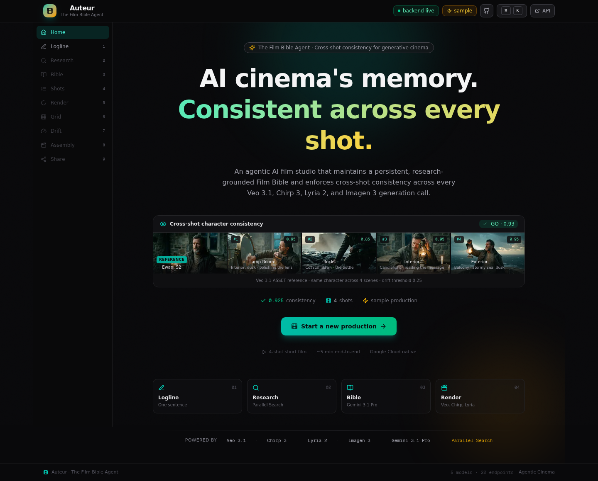
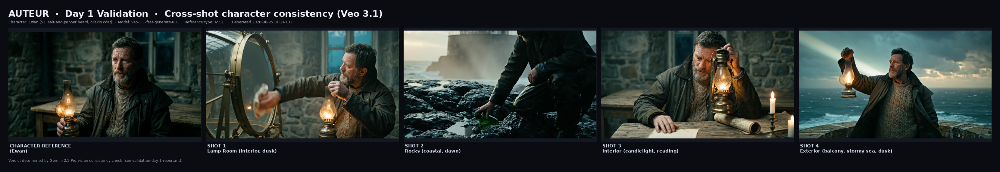
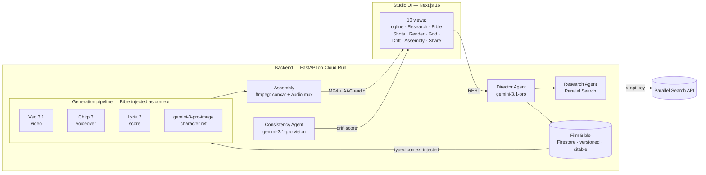

# Auteur — The Film Bible Agent

> **AI cinema's memory. Grounded in reality. Consistent across every shot.**

[](./LICENSE)
[](https://fastapi.tiangolo.com/)
[](https://nextjs.org/)
[](https://cloud.google.com/run)

<p align="center">
  <a href="https://auteur-app-jbkbgthudq-uc.a.run.app">
    
  </a>
</p>

<p align="center">
  <a href="https://auteur-app-jbkbgthudq-uc.a.run.app"><strong>Try the live app →</strong></a>
  &nbsp;·&nbsp;
  <a href="https://auteur-dev-jbkbgthudq-uc.a.run.app/api/docs">API docs</a>
</p>

---

## Same character. Four scenes.

One character reference image is generated from the logline. The Director Agent then produces four shots across four different scenes, each one injecting the same Film Bible as context. The Consistency Check Agent scores each output against the reference.

| Shot | Scene | Face | Age | Beard | Wardrobe | **Overall** |
|------|-------|------|-----|-------|----------|------------|
| 1 | Lamp Room (interior, dusk) | 0.95 | 0.95 | 0.95 | 0.95 | **0.95** |
| 2 | Rocks (coastal, dawn) | 0.80 | 0.90 | 0.90 | 0.90 | **0.85** |
| 3 | Interior (candlelight) | 0.95 | 0.95 | 0.95 | 0.95 | **0.95** |
| 4 | Exterior (balcony, storm) | 0.95 | 0.95 | 0.95 | 0.95 | **0.95** |

**Mean overall: 0.925 · Verdict: GO** (drift threshold 0.25)

One Film Bible. Four generations. One coherent character. Full evidence in [`docs/validation-day-1-report.md`](./docs/validation-day-1-report.md).

<p align="center">
  
</p>

> **Methodology:** consistency scores are model-based evaluation scores produced by the Consistency Check Agent (`gemini-3.1-pro-preview` vision) using a fixed rubric across five dimensions (face identity, age appearance, beard/facial hair, wardrobe, overall). The `overall` score is produced independently by the model as part of the same JSON response (it is not a computed mean of the per-dimension scores). They are internal evaluation metrics, not a claim of objective perceptual similarity. Drift = 1.0 − overall. Accept threshold: overall ≥ 0.75.

---

## The 30-second explanation

Auteur is the memory layer for AI filmmaking. It creates a persistent **Film Bible** from real-world research, injects that structured memory into every generation call, automatically checks every shot for character and style drift, and assembles the final film — voiceover and score synchronized — when every shot passes.

The bottleneck in AI cinema is not generation quality. Veo 3.1 already produces gorgeous clips. The bottleneck is **consistency** — characters drift, wardrobes mutate, voices lose continuity across shots. Every existing tool treats each generation call as stateless. Auteur is the layer that makes the agent stateful across the entire film.

## The problem

Four generation calls produce four clips that look like four different films stitched together, not one film. The same character walks in with a different face. The wardrobe changes between cuts. The voice doesn't match. The color grade drifts. This is the problem that blocks indie filmmakers and small studios from shipping AI short films today — not the quality of any single clip.

## The breakthrough

**Consistency, not quality, is the bottleneck.** This is a software-architecture problem, not a model-capability problem. The generation models already work. What is missing is a persistent, structured, research-grounded memory of the entire film, injected as typed context into every downstream generation call.

## The Film Bible

The core primitive. A typed Pydantic schema (characters, locations, wardrobes, voice profiles, score motifs, style anchors, story beats), versioned in Firestore, citable in every generation.

```
                     Film
                       │
                 Bible v1 (immutable)
                       │
        ┌──────────────┼──────────────┐
        │              │              │
     Shot 1         Shot 2    …    Shot 4
        │              │              │
        └──────────────┼──────────────┘
                       │
              consistency check (per shot)
                       │
                 Bible v2 (new edit)
                       │
              future generations cite v2
```

Three properties make it work:

1. **Typed, not free-text.** Every generation call receives the relevant bible entries as structured context the agent can validate — not prompt noise.
2. **Versioned, not overwritten.** Every edit creates a new immutable version. Every generation cites which version it used. Drift becomes detectable and attributable across edits.
3. **Injected, not suggested.** The Bible's modality-specific context is injected into each generation call: the character reference image into Veo (as an ASSET reference), the voice profile into Chirp, and the score motif into Lyria. Consistency is enforced by the architecture, not requested by the prompt.

| Collection | Captures |
|------------|----------|
| `characters` | Name, age, description, voice profile, wardrobe, reference image |
| `locations` | Name, era, description, grounding references |
| `wardrobes` | Garment, fabric, color per character |
| `voice_profiles` | Voice model, voice name, description per character |
| `score_motifs` | Prompt, instrument, mood |
| `style_anchors` | Color grade, aspect ratio, photographic aesthetic, mood |
| `story_beats` | Ordered narrative beats — the shot list is derived from these |

## How Auteur works — the closed loop

```
   Logline
      │
      ▼
  Research ──────▶ Parallel Search (runtime, visible in UI)
      │
      ▼
  Film Bible v1 (typed, versioned, persisted)
      │
      ▼
  Generate ──────▶ Veo 3.1 + Chirp 3 + Lyria 2 (Bible injected as context)
      │
      ▼
  Consistency Check ─▶ Gemini 3.1 Pro Vision (drift score 0.0–1.0)
      │
      ├── PASS (drift ≤ 0.25) ──▶ next shot
      │
      └── DRIFT (drift > 0.25) ──▶ regenerate with the drift report injected
                                      as corrective context
                                      │
                                      ▼
                              drift tracked across re-generations
      │
      ▼
  Assemble ──────▶ ffmpeg: concat Veo clips + mux voiceover/score → final MP4
      │
      ▼
   Share
```

The loop is what makes this an agentic system rather than an LLM wrapper: the Consistency Check Agent's drift score feeds back into re-generation decisions, and drift is tracked across re-generations per shot within a project.

Two endpoints close the loop:

- **`POST /shots/{id}/regenerate`** — caller-driven. Fetches the prior drift report, injects the per-attribute scores into the Veo prompt as targeted corrective context (e.g. "prior face identity 0.70 — preserve the exact facial features from the reference"), re-runs generation, re-checks. The regeneration is diagnosis-informed, not a fresh stochastic sample.
- **`POST /shots/auto-regenerate`** — the autonomous loop. Runs the consistency check on every shot, then for every shot whose drift exceeds 0.25, automatically triggers regeneration with the drift report injected as corrective context, and re-checks. The system itself decides which shots to regenerate based on the threshold — no caller-specified shot IDs.

### A real before/after

Captured on the deployed backend via `POST /regenerate` with `use_drift_correction=true`. The first generation received only the Bible as context; the regeneration received the Bible **plus** the prior drift report as corrective context:

```
SHOT 1 — FIRST GENERATION (Bible only)
  face_identity: 0.70   age_appearance: 0.70   beard: 0.70   wardrobe: 0.95
  overall: 0.85   drift: 0.15   verdict: ACCEPT

        │  POST /regenerate  (drift report → corrective context → Veo)

        ▼
SHOT 1 — REGENERATION (Bible + drift diagnosis)
  face_identity: 0.80   age_appearance: 0.90   beard: 0.90   wardrobe: 0.95
  overall: 0.90   drift: 0.10   verdict: ACCEPT
```

Face identity improved 0.70 → 0.80, age 0.70 → 0.90, beard 0.70 → 0.90. The corrective context directed Veo to prioritize the drifted dimensions from the character reference. Full evidence in [`docs/regeneration-evidence.json`](./docs/regeneration-evidence.json).

## Why Parallel

Generative filmmaking has two memory problems. Auteur solves both.

| Memory problem | Question | Solved by |
|----------------|----------|-----------|
| **Creative memory** | What must remain consistent across the film? | The **Film Bible** (typed, versioned, injected) |
| **World memory** | What should the film know about reality? | **Parallel Search** (runtime, visible, cached) |

```
                  AUTEUR
                    │
         ┌──────────┴──────────┐
         ▼                     ▼
   Film Memory           World Knowledge
         │                     │
   Film Bible             Parallel Search
         │                     │
         └──────────┬──────────┘
                    ▼
           Grounded Generation
                    ▼
           Consistency Check
                    ▼
               Final Film
```

Parallel is not a bolted-on API. It is one half of the intelligence architecture. The Research Agent calls it at runtime to ground every creative decision (era, location, fashion, slang, music, lighting) in real-world references. The call site is visible in the live Research panel — every query and result streams in real time. If Parallel is unavailable, the Research Agent logs the failure, returns empty refs, and the Director synthesizes the Bible from the logline. The pipeline does not hard-fail. Verified by `backend/tests/test_fallback_no_parallel_key.py`.

## Proof

The claims above are demonstrated, not asserted.

| Capability | Evidence |
|------------|---------|
| 4-shot generation (Veo 3.1) | 4 clips, 4 scenes, mean consistency **0.925** — [`docs/validation-day-1-report.md`](./docs/validation-day-1-report.md) |
| Film Bible persistence | Firestore, versioned, citable — `GET /api/projects/{id}/bible` returns the typed schema |
| Bible version attribution | Every shot cites its bible version — `GET /api/projects/{id}/shots` |
| Parallel runtime research | Live Research panel streams queries + results — verified in the deployed UI |
| Drift detection | Per-shot drift scores (face/age/beard/wardrobe/overall) — `POST /check-all` |
| Closed-loop regeneration | Re-generation with drift-diagnosis context improved overall 0.85 → 0.90 (drift 0.15 → 0.10) — [`docs/regeneration-evidence.json`](./docs/regeneration-evidence.json) |
| Autonomous loop | `POST /auto-regenerate` checks all shots, auto-regenerates those above the 0.25 drift threshold — `backend/api/shots.py` |
| Voice + score muxing | Chirp voiceover + Lyria score mixed per shot, mean volume **-23.6 dB** (audible) — `backend/tests/test_assembly_audio.py` |
| Final MP4 assembly | ffmpeg concat + AAC audio mux, `has_audio=True` — `GET /api/projects/{id}/film` |
| ADK agents | Three agents on Google Agent Development Kit — `backend/agents/adk_registry.py` |
| Deployed end-to-end | Full pipeline on Cloud Run — `backend/tests/e2e_deployed_audio.py` (exit 0) |
| Graceful degradation | Pipeline runs without PARALLEL_API_KEY — `backend/tests/test_fallback_no_parallel_key.py` (exit 0) |
| Smoke test | 12/12 endpoints OK — `backend/tests/test_api_smoke.py` |

Run them: `python3 backend/tests/test_api_smoke.py && python3 backend/tests/test_assembly_audio.py && python3 backend/tests/test_fallback_no_parallel_key.py`

## Who this is for

Indie filmmakers and small studios who want to make AI short films and cannot today because the output is incoherent.

**Without Auteur:** filmmaker generates → notices a continuity error → regenerates → manually fixes the prompt → regenerates → loses another character detail → repeats.

**With Auteur:** filmmaker defines the film once → Auteur remembers it → every generation inherits it → every shot is checked → failures trigger regeneration automatically.

The value proposition: less iteration, less manual continuity management, more coherent output. The community exists (Curious Refuge, the Runway AI Film Festival, r/aivideo). The market is underserved, not hypothetical.

## Why the insight holds

"Consistency, not quality, is the bottleneck" is a software-architecture insight, not a model-capability claim — so it cannot be invalidated by the next model release. The mechanism is hard to replicate: the schema must be expressive enough to capture all modalities (character, world, voice, score, style) but constrained enough to be injectable without exceeding token limits; the injection protocol must be deterministic (every Veo call for the same character receives the same Bible context); the consistency check must be calibrated (too strict and every shot fails, too loose and drift slips through). Each is a real engineering constraint, not a prompt trick.

---

## The agent architecture

Three agents on Google Agent Development Kit, with a 6-layer memory architecture that keeps ephemeral, persistent, versioned, and historical data in the right store.

| Agent | Model | Role |
|-------|-------|------|
| Director | `gemini-3.1-pro-preview` | Orchestrator. Logline in, plans the pipeline, delegates to Research and Consistency, writes the Bible, generates the shot list. |
| Research | `gemini-3.1-pro-preview` | Calls Parallel Search at runtime, synthesizes typed `Reference` objects. Read-only — returns results to the Director. |
| Consistency Check | `gemini-3.1-pro-preview` (vision) | Extracts a frame from each Veo clip, scores drift against the character reference, produces an accept/re-generate recommendation. |

| Memory layer | Store | Content |
|--------------|-------|---------|
| L1 Working | In-process | Current tool-call args + last 5 tool results |
| L2 Project state | Firestore `projects/{id}` | Project, Bible, shots, generation log |
| L3 Bible versions | Firestore `bibles/{projectId}_{version}` | Immutable snapshots — every edit creates a new version |
| L4 Search cache | Firestore `search_cache/{projectId}_{queryHash}` | Parallel Search results, 24h TTL |
| L5 Rendered artifacts | Cloud Storage | Veo MP4s, Chirp WAVs, Lyria WAVs, character-ref PNGs |
| L6 Drift history | Firestore | Per-shot drift scores across re-generations |

The Director selects among 6 external tools (Parallel Search, Veo, Chirp, Lyria, Imagen, Gemini Vision) and 3 internal tools (`build_bible`, `generate_shot_list`, `assemble_film`) to move a logline through the full pipeline.

## The studio interface

Ten views map to the filmmaking workflow: **Logline → Research → Bible → Shots → Render → Grid → Drift → Assembly → Share**. A filmmaker recognizes the shape immediately — script pane, bible pane, shot grid, render queue, consistency dashboard. The Bible is visible and editable at every step: the user can see what the agent remembers and change it.

The signature moment is the **SideBySide** component: one character reference + four generated shot frames, each with its consistency score, demonstrating the character was held together across four different scenes. It appears on the landing, grid, and share views.

A command palette (⌘K) navigates the workflow with fuzzy-searchable actions. Every view has loading, empty, and error states with retry.

## Architecture



The Director Agent is the orchestrator: logline in, research delegated to the Research Agent (Parallel Search at runtime), Bible synthesized via Gemini 3.1 Pro and persisted as an immutable versioned snapshot, shot list generated, each shot's generation call receives the Bible as injected context, the Consistency Agent scores drift per shot, and Assembly concatenates the Veo clips while muxing the Chirp voiceover (full volume) + Lyria score (25% as a bed), trimmed and padded to each shot's exact duration, into the final MP4 with synchronized AAC audio.

See [`ARCHITECTURE.md`](./ARCHITECTURE.md) for the full component justification.

---

## Stack

| Layer | Choice | Why |
|-------|--------|-----|
| LLM (orchestration + vision) | `gemini-3.1-pro-preview` via Vertex AI (global region) | Orchestration, Bible synthesis, and vision-based consistency evaluation |
| Agent framework | Google Agent Development Kit (ADK) | Agent orchestration primitives |
| Video | Veo 3.1 (`veo-3.1-fast-generate-001`) | ASSET reference images for cross-shot character consistency |
| Voice | Chirp 3 (`gemini-3.1-flash-tts-preview`) | Prebuilt voices; 24kHz PCM output |
| Music | Lyria 2 (`lyria-002`) | Cinematic score generation |
| Image | `gemini-3-pro-image` (global region) | Character reference generation |
| Persistence | Firestore | Serverless, schema-flexible, sync client |
| Object storage | Cloud Storage | Rendered MP4s, WAVs, PNGs |
| Deployment | Cloud Run (min 1, max 10) | Always-warm, autoscaling |
| Partner integration | Parallel Search API | Runtime world-knowledge grounding |

---

## Quickstart (local, ~15 minutes)

### Prerequisites

- Python 3.12+
- Node.js 20+ (or [Bun](https://bun.sh))
- A Google Cloud project with Vertex AI, Firestore, and Cloud Storage enabled
- A service-account JSON key with `aiplatform.user`, `datastore.user`, and `storage.objectAdmin` scopes
- A Parallel Search API key (the app runs without it — the Research Agent returns empty refs and the Director synthesizes from the logline)

### Steps

```bash
# 1. Clone
git clone https://github.com/sodiq-code/auteur.git
cd auteur

# 2. Backend
python3 -m venv .venv && source .venv/bin/activate
pip install -r backend/requirements.txt

# 3. Configure
cp .env.example .env
# Edit .env:
#   PARALLEL_API_KEY=...
#   GOOGLE_APPLICATION_CREDENTIALS=/path/to/auteur-sa-key.json
#   GCP_PROJECT_ID=your-gcp-project

# 4. Run the backend (FastAPI on :8000)
source .env
uvicorn backend.main:app --host 0.0.0.0 --port 8000 --reload

# 5. In a second terminal, run the frontend (Next.js on :3000)
cd frontend
bun install && bun run dev
# → open http://localhost:3000

# 6. Verify
curl http://localhost:8000/api/health   # → {"status":"ok", ...}
```

### Run the tests

```bash
python3 backend/tests/test_api_smoke.py                # 12/12 endpoints
python3 backend/tests/test_assembly_audio.py          # audio-mux unit test
python3 backend/tests/test_fallback_no_parallel_key.py # graceful degradation
python3 backend/tests/e2e_deployed_audio.py           # deployed E2E
```

See [`RUNBOOK.md`](./RUNBOOK.md) for deploy, debug, and rollback procedures.

---

## Repository structure

```
auteur/
├── README.md                       # this file
├── ARCHITECTURE.md                 # component justification + data flow
├── RUNBOOK.md                      # operations + troubleshooting runbook
├── LICENSE                         # MIT
├── .env.example                    # all required env vars
├── docs/
│   ├── studio-screenshot.png       # the studio UI screenshot (above)
│   ├── api-contract.md             # REST API reference (22 endpoints)
│   ├── bible-schema.md             # Film Bible schema reference
│   ├── demo-script.md              # 5-beat demo script
│   ├── partner-integration.md      # Parallel Search integration notes
│   └── validation-day-1-report.md  # cross-shot consistency validation
├── backend/
│   ├── requirements.txt
│   ├── main.py                     # FastAPI app + router mounting
│   ├── agents/                     # Director, Research, Consistency Check (ADK)
│   ├── bible/                      # schema.py, store.py, versioning.py
│   ├── pipelines/                  # generate.py, assemble.py, check.py
│   ├── integrations/               # parallel_search, veo, chirp, lyria, imagen, gemini
│   ├── api/                        # FastAPI routes (22 endpoints)
│   ├── prompts/                    # version-controlled prompts
│   ├── storage/                    # firestore.py, cloud_storage.py
│   └── tests/
│       ├── test_api_smoke.py                # 12-endpoint smoke test
│       ├── test_assembly_audio.py           # audio-mux unit test (synthetic)
│       ├── test_fallback_no_parallel_key.py # graceful-degradation test
│       └── e2e_deployed_audio.py            # deployed E2E verification
├── frontend/                       # Next.js 16 (App Router) — studio UI
└── infra/
    ├── cloudbuild.yaml
    ├── deploy_cloud_run.py         # backend deploy
    ├── deploy-unified.py           # unified (frontend + backend) deploy
    └── seed-demo.sh                # sample-production seeding
```

---

## API surface (22 endpoints)

| Method | Path | Purpose |
|--------|------|---------|
| `GET` | `/api/health` | Backend health + model/partner status |
| `GET` | `/api/demo` | Sample production |
| `POST` | `/api/projects` | Create a project from a logline |
| `GET` | `/api/projects/{id}` | Get project state |
| `POST` | `/api/projects/{id}/build-bible` | Director Agent: research + synthesize Bible |
| `GET` | `/api/projects/{id}/research` | Get cached research references |
| `GET` | `/api/projects/{id}/bible` | Get the current Bible version |
| `PATCH` | `/api/projects/{id}/bible/entries/{entryId}` | Edit a Bible entry (creates a new version) |
| `GET` | `/api/projects/{id}/shots` | Get the shot list |
| `POST` | `/api/projects/{id}/shots/{shotId}/generate` | Generate a shot (Veo + Chirp + Lyria) |
| `POST` | `/api/projects/{id}/shots/{shotId}/regenerate` | Re-generate a shot (drift-diagnosis-informed) |
| `GET` | `/api/projects/{id}/shots/{shotId}/consistency` | Get the drift report |
| `POST` | `/api/projects/{id}/shots/{shotId}/consistency` | Run the consistency check |
| `POST` | `/api/projects/{id}/shots/check-all` | Check all shots |
| `POST` | `/api/projects/{id}/shots/auto-regenerate` | The autonomous loop (auto-regenerate drifted shots) |
| `POST` | `/api/projects/{id}/assemble` | Assemble the final film (mux audio) |
| `POST` | `/api/projects/{id}/share` | Create a public share slug |
| `GET` | `/api/share/{slug}` | Public share view |
| `GET` | `/api/projects/{id}/export/bible` | Export the Bible as JSON |
| `GET` | `/api/projects/{id}/export/shots` | Export the shot list as CSV |
| `GET` | `/api/projects/{id}/film` | Stream the assembled MP4 |
| `GET` | `/api/projects/{id}/shots/{shotId}/video` | Stream a single shot's MP4 |
| `GET` | `/api/projects/{id}/events` | Audit log |

See [`docs/api-contract.md`](./docs/api-contract.md) for the full contract.

---

## License

MIT — see [`LICENSE`](./LICENSE).

## Links

- **Repo:** <https://github.com/sodiq-code/auteur>
- **Studio UI:** <https://auteur-app-jbkbgthudq-uc.a.run.app>
- **Agentic Cinema:** <https://agentic-cinema.devpost.com/>
