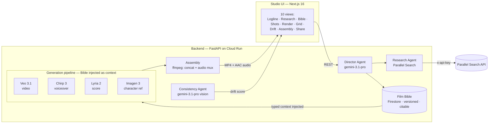

# Auteur — The Film Bible Agent

> **AI cinema's memory. Grounded in reality. Consistent across every shot.**

[](./LICENSE)
[](https://fastapi.tiangolo.com/)
[](https://nextjs.org/)
[](https://cloud.google.com/run)

<p align="center">
  <a href="https://auteur-app-jbkbgthudq-uc.a.run.app">
    
  </a>
</p>

<p align="center">
  <a href="https://auteur-app-jbkbgthudq-uc.a.run.app"><strong>Try the live app →</strong></a>
  &nbsp;·&nbsp;
  <a href="https://auteur-dev-jbkbgthudq-uc.a.run.app/api/docs">API docs</a>
</p>

---

## The problem

Veo 3.1 and Sora 2 produce gorgeous individual clips. The unsolved problem in AI cinema is **not** generation quality — it is **consistency**. Characters drift across shots. Wardrobes mutate. Voices lose continuity. Color grades do not match. The result of four generation calls looks like four different films stitched together, not one film.

Every existing tool treats each generation call as stateless. There is no persistent project-memory layer that every generation call must obey. This is the bottleneck that blocks indie filmmakers and small studios from shipping AI short films today.

## The insight

**Consistency, not quality, is the bottleneck.** This is a software-architecture problem, not a model-capability problem. The generation models already work. What is missing is a persistent, structured, research-grounded memory of the entire film, injected as typed context into every downstream generation call.

## The one mechanism

Auteur closes that gap with a single architectural primitive: the **Film Bible** — a typed Pydantic schema (characters, locations, wardrobes, voice profiles, score motifs, style anchors, story beats), versioned in Firestore, citable in every generation, with a Gemini-Vision Consistency Check Agent producing drift scores that feed back into re-generation.

This converts cross-shot consistency from a *model-capability* problem (which the models do not solve) into a *software-architecture* problem (which Auteur solves). Three properties make it work:

1. **Typed, not free-text.** Every generation call receives the relevant bible entries as structured context the agent can validate — not prompt noise.
2. **Versioned, not overwritten.** Every edit creates a new immutable version. Every generation cites which version it used. Drift becomes detectable and attributable.
3. **Injected, not suggested.** The same character reference, wardrobe, voice profile, and score motif are passed to every Veo, Chirp, Lyria, and Imagen call for the same film. Consistency is enforced by the architecture, not requested by the prompt.

## What a user sees

A filmmaker writes one logline. The Director Agent researches it via Parallel Search, synthesizes a typed Film Bible via Gemini 3.1 Pro, generates a 4-shot short film with synchronized voiceover and score, checks each shot for drift against the character reference, and assembles the final MP4 — with the Bible visible and editable at every step. The entire pipeline is one click.

The signature moment: the same character, held consistent across four different scenes, because one agent remembered all of it.

---

## The agent architecture

Three agents on Google Agent Development Kit, with a 6-layer memory architecture that keeps ephemeral, persistent, versioned, and historical data in the right store.

| Agent | Model | Role |
|-------|-------|------|
| Director | `gemini-3.1-pro-preview` | Orchestrator. Logline in, plans the pipeline, delegates to Research and Consistency, writes the Bible, generates the shot list. |
| Research | `gemini-3.1-pro-preview` | Calls Parallel Search at runtime, synthesizes typed `Reference` objects. Read-only — returns results to the Director. |
| Consistency Check | `gemini-3.1-pro-preview` (vision) | Extracts a frame from each Veo clip, scores drift against the character reference, produces an accept/re-generate recommendation. |

| Memory layer | Store | Content |
|--------------|-------|---------|
| L1 Working | In-process | Current tool-call args + last 5 tool results |
| L2 Project state | Firestore `projects/{id}` | Project, Bible, shots, generation log |
| L3 Bible versions | Firestore `bibles/{projectId}_{version}` | Immutable snapshots — every edit creates a new version |
| L4 Search cache | Firestore `search_cache/{projectId}_{queryHash}` | Parallel Search results, 24h TTL |
| L5 Rendered artifacts | Cloud Storage | Veo MP4s, Chirp WAVs, Lyria WAVs, character-ref PNGs |
| L6 Drift history | Firestore | Per-shot drift scores across re-generations |

The Director selects among 6 external tools (Parallel Search, Veo, Chirp, Lyria, Imagen, Gemini Vision) and 3 internal tools (`build_bible`, `generate_shot_list`, `assemble_film`) to move a logline through the full pipeline. The Consistency Check Agent produces a per-shot drift score (0.0–1.0); drift above 0.25 triggers re-generation with stricter Bible injection, and drift is tracked across re-generations per shot. The loop is closed.

## The studio interface

Ten views map to the filmmaking workflow: **Logline → Research → Bible → Shots → Render → Grid → Drift → Assembly → Share**. A filmmaker recognizes the shape immediately — script pane, bible pane, shot grid, render queue, consistency dashboard. The Bible is visible and editable at every step: the user can see what the agent remembers and change it.

The signature moment is the **SideBySide** component: one character reference + four generated shot frames, each with its consistency score, proving the character was held together across four different scenes. It appears on the landing, grid, and share views.

A command palette (⌘K) navigates the workflow with fuzzy-searchable actions. Every view has loading, empty, and error states with retry.

## Who this is for

Indie filmmakers and small studios who want to make AI short films and cannot today because the output is incoherent. The problem is verified and unsolved: Runway Gen-4 reaches ~95% consistency within a single reference image and degrades across many shots; Sora 2 is weaker. No commercial product ships a persistent project-memory layer for generative video.

The community exists: Curious Refuge (~20k members), the Runway AI Film Festival, r/aivideo. The market is underserved, not hypothetical.

## Why the insight holds

"Consistency, not quality, is the bottleneck" is a software-architecture insight, not a model-capability claim — so it cannot be invalidated by the next model release. The mechanism is hard to replicate: the schema must be expressive enough to capture all modalities (character, world, voice, score, style) but constrained enough to be injectable without exceeding token limits; the injection protocol must be deterministic (every Veo call for the same character receives the same Bible context); the consistency check must be calibrated (too strict and every shot fails, too loose and drift slips through). Each of these is a real engineering constraint, not a prompt trick.

---

## Architecture



The Director Agent is the orchestrator: logline in, research delegated to the Research Agent (Parallel Search at runtime), Bible synthesized via Gemini 3.1 Pro and persisted as an immutable versioned snapshot, shot list generated, each shot's generation call receives the Bible as injected context, the Consistency Agent scores drift per shot, and Assembly concatenates the Veo clips while muxing the Chirp voiceover (full volume) + Lyria score (25% as a bed), trimmed and padded to each shot's exact duration, into the final MP4 with synchronized AAC audio.

See [`ARCHITECTURE.md`](./ARCHITECTURE.md) for the full component justification, the 6-layer memory architecture, and the tech-stack decisions.

---

## The Film Bible

The Bible is a typed Pydantic model persisted as an immutable, versioned snapshot in Firestore. Every generation call cites the Bible version it was built from.

| Collection | Captures |
|------------|----------|
| `characters` | Name, age, description, voice profile, wardrobe, reference image |
| `locations` | Name, era, description, grounding references |
| `wardrobes` | Garment, fabric, color per character |
| `voice_profiles` | Voice model, voice name, description per character |
| `score_motifs` | Prompt, instrument, mood |
| `style_anchors` | Color grade, aspect ratio, photographic aesthetic, mood |
| `story_beats` | Ordered narrative beats — the shot list is derived from these |

Each Bible is an append-only snapshot. Editing a field creates a new version (`bible_v1` → `bible_v2`); the previous version is immutable. Every shot cites the version it was generated from, so drift is attributable across edits.

---

## Partner integration — Parallel Search

The Parallel Search API is called at runtime by the Research Agent to ground every creative decision (era, location, fashion, slang, music, lighting) in real-world references. The call site is visible in the live **Research panel** of the deployed UI — every query and result streams in real time. This is the partner integration, called at runtime, not a README mention.

If the Parallel Search API is unavailable (key missing, rate-limited, or the endpoint is down), the Research Agent logs the failure, returns an empty reference list, and the Director Agent synthesizes the Bible from the logline alone via creative inference. The pipeline does not hard-fail on a partner-API outage. This is verified by `backend/tests/test_fallback_no_parallel_key.py`.

---

## Stack

| Layer | Choice | Why |
|-------|--------|-----|
| LLM (orchestration + vision) | `gemini-3.1-pro-preview` via Vertex AI (global region) | Newest accessible Pro model; text + vision in one call |
| Agent framework | Google Agent Development Kit (ADK) | Required agent framework |
| Video | Veo 3.1 (`veo-3.1-fast-generate-001`) | Supports ASSET reference images for cross-shot character consistency |
| Voice | Chirp 3 (`gemini-2.5-flash-tts`) | Prebuilt voices; 24kHz PCM output |
| Music | Lyria 2 (`lyria-002`) | Cinematic score generation |
| Image | `gemini-3-pro-image` (global region) | Character reference generation (Imagen 3 is deprecated on this project) |
| Persistence | Firestore | Serverless, schema-flexible, sync client |
| Object storage | Cloud Storage | Rendered MP4s, WAVs, PNGs |
| Deployment | Cloud Run (min 1, max 10) | Always-warm, autoscaling |
| Partner integration | Parallel Search API (runtime, visible in UI) | Grounded imagination |

---

## Repository structure

```
auteur/
├── README.md                       # this file
├── ARCHITECTURE.md                 # component justification + data flow
├── RUNBOOK.md                      # operations + troubleshooting runbook
├── LICENSE                         # MIT
├── .env.example                    # all required env vars
├── docs/
│   ├── studio-screenshot.png       # the studio UI screenshot (above)
│   ├── api-contract.md             # REST API reference (22 endpoints)
│   ├── bible-schema.md             # Film Bible schema reference
│   ├── demo-script.md              # 5-beat demo script
│   ├── partner-integration.md      # Parallel Search integration notes
│   └── validation-day-1-report.md  # cross-shot consistency validation
├── backend/
│   ├── requirements.txt
│   ├── main.py                     # FastAPI app + router mounting
│   ├── agents/                     # Director, Research, Consistency Check (ADK)
│   ├── bible/                      # schema.py, store.py, versioning.py
│   ├── pipelines/                  # generate.py, assemble.py, check.py
│   ├── integrations/               # parallel_search, veo, chirp, lyria, imagen, gemini
│   ├── api/                        # FastAPI routes (22 endpoints)
│   ├── prompts/                    # version-controlled prompts
│   ├── storage/                    # firestore.py, cloud_storage.py
│   └── tests/
│       ├── test_api_smoke.py                # 12-endpoint smoke test
│       ├── test_assembly_audio.py           # audio-mux unit test (synthetic)
│       ├── test_fallback_no_parallel_key.py # graceful-degradation test
│       └── e2e_deployed_audio.py            # deployed E2E verification
├── frontend/                       # Next.js 16 (App Router) — studio UI
└── infra/
    ├── cloudbuild.yaml
    ├── deploy_cloud_run.py         # backend deploy
    ├── deploy-unified.py           # unified (frontend + backend) deploy
    └── seed-demo.sh                # sample-production seeding
```

---

## Quickstart (local, ~15 minutes)

### Prerequisites

- Python 3.12+
- Node.js 20+ (or [Bun](https://bun.sh))
- A Google Cloud project with Vertex AI, Firestore, and Cloud Storage enabled
- A service-account JSON key with `aiplatform.user`, `datastore.user`, and `storage.objectAdmin` scopes
- A Parallel Search API key (the app runs without it — the Research Agent returns empty refs and the Director synthesizes from the logline)

### Steps

```bash
# 1. Clone
git clone https://github.com/sodiq-code/auteur.git
cd auteur

# 2. Backend
python3 -m venv .venv && source .venv/bin/activate
pip install -r backend/requirements.txt

# 3. Configure
cp .env.example .env
# Edit .env:
#   PARALLEL_API_KEY=...
#   GOOGLE_APPLICATION_CREDENTIALS=/path/to/auteur-sa-key.json
#   GCP_PROJECT_ID=your-gcp-project

# 4. Run the backend (FastAPI on :8000)
source .env
uvicorn backend.main:app --host 0.0.0.0 --port 8000 --reload

# 5. In a second terminal, run the frontend (Next.js on :3000)
cd frontend
bun install && bun run dev
# → open http://localhost:3000

# 6. Verify
curl http://localhost:8000/api/health   # → {"status":"ok", ...}
```

### Run the tests

```bash
# Smoke test (start the backend first):
python3 backend/tests/test_api_smoke.py

# Audio-mux unit test (synthetic inputs, no API calls):
python3 backend/tests/test_assembly_audio.py

# Graceful-degradation test (no PARALLEL_API_KEY needed):
python3 backend/tests/test_fallback_no_parallel_key.py

# Deployed E2E test (runs against the live Cloud Run backend):
python3 backend/tests/e2e_deployed_audio.py
```

See [`RUNBOOK.md`](./RUNBOOK.md) for deploy, debug, and rollback procedures.

---

## API surface (22 endpoints)

| Method | Path | Purpose |
|--------|------|---------|
| `GET` | `/api/health` | Backend health + model/partner status |
| `GET` | `/api/demo` | Sample production |
| `POST` | `/api/projects` | Create a project from a logline |
| `GET` | `/api/projects/{id}` | Get project state |
| `POST` | `/api/projects/{id}/build-bible` | Director Agent: research + synthesize Bible |
| `GET` | `/api/projects/{id}/research` | Get cached research references |
| `GET` | `/api/projects/{id}/bible` | Get the current Bible version |
| `PATCH` | `/api/projects/{id}/bible/entries/{entryId}` | Edit a Bible entry (creates a new version) |
| `GET` | `/api/projects/{id}/shots` | Get the shot list |
| `POST` | `/api/projects/{id}/shots/{shotId}/generate` | Generate a shot (Veo + Chirp + Lyria) |
| `POST` | `/api/projects/{id}/shots/{shotId}/regenerate` | Re-generate a shot |
| `GET` | `/api/projects/{id}/shots/{shotId}/consistency` | Get the drift report |
| `POST` | `/api/projects/{id}/shots/{shotId}/consistency` | Run the consistency check |
| `POST` | `/api/projects/{id}/shots/check-all` | Check all shots |
| `POST` | `/api/projects/{id}/assemble` | Assemble the final film (mux audio) |
| `POST` | `/api/projects/{id}/share` | Create a public share slug |
| `GET` | `/api/share/{slug}` | Public share view |
| `GET` | `/api/projects/{id}/export/bible` | Export the Bible as JSON |
| `GET` | `/api/projects/{id}/export/shots` | Export the shot list as CSV |
| `GET` | `/api/projects/{id}/film` | Stream the assembled MP4 |
| `GET` | `/api/projects/{id}/shots/{shotId}/video` | Stream a single shot's MP4 |
| `GET` | `/api/projects/{id}/events` | Audit log |

See [`docs/api-contract.md`](./docs/api-contract.md) for the full contract.

---

## License

MIT — see [`LICENSE`](./LICENSE).

## Links

- **Repo:** <https://github.com/sodiq-code/auteur>
- **Studio UI:** <https://auteur-app-jbkbgthudq-uc.a.run.app>
- **Agentic Cinema:** <https://agentic-cinema.devpost.com/>
