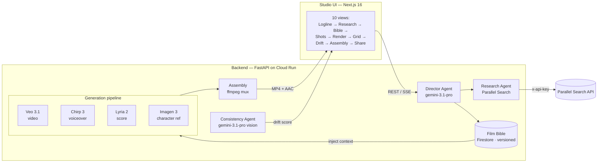

# Auteur — The Film Bible Agent

> **AI cinema's memory. Grounded in reality. Consistent across every shot.**

[](./LICENSE)
[](https://fastapi.tiangolo.com/)
[](https://nextjs.org/)
[](https://cloud.google.com/run)

<p align="center">
  
</p>

Auteur is an agentic AI film studio that maintains a persistent, research-grounded
**Film Bible** (characters, locations, wardrobes, voices, score motifs, style anchors,
story beats) and enforces **cross-shot consistency** across every Veo 3.1, Chirp 3,
Lyria 2, and Imagen 3 generation call.

The bottleneck in AI cinema is **memory, not generation**. Every existing tool treats
each generation call as stateless — characters drift across shots, wardrobes mutate,
voices lose continuity, color grades don't match. Auteur makes the agent stateful
across the entire film with a single architectural primitive: a typed, versioned,
citable Film Bible that a Director Agent maintains and **injects into every
generation call**. The result is a short film that looks like one film, not four.

---

## Live deployment

| Surface | URL |
|---------|-----|
| **Studio UI** | <https://auteur-app-jbkbgthudq-uc.a.run.app> |
| **Backend API health** | <https://auteur-dev-jbkbgthudq-uc.a.run.app/api/health> |
| **API docs (Swagger)** | <https://auteur-dev-jbkbgthudq-uc.a.run.app/api/docs> |
| **Pre-rendered sample production** | <https://auteur-dev-jbkbgthudq-uc.a.run.app/api/demo> |

The deployed app loads in under 0.3 seconds and ships a pre-rendered sample
production (the lighthouse-keeper 4-shot demo) as a safety net, so the landing
page always shows the cross-shot consistency proof even if live generation is
unavailable.

---

## The core innovation — the Film Bible persistence-and-injection layer

A typed Pydantic schema stored in Firestore, **versioned**, **citable**, and injected
as structured context into every Veo 3.1 / Chirp 3 / Lyria 2 / Imagen 3 call. This
converts cross-shot consistency from a *model-capability* problem (which the models
do not solve) into a *software-architecture* problem (which Auteur solves).

The signature demo moment: a **side-by-side** of the same logline, the same character
reference, four shots across four scenes — once generated **without** the Film Bible
(chaotic drift), once generated **with** the Film Bible (visibly consistent). The
visual proof is immediate, undeniable, and impossible to forget.

---

## Architecture



The Director Agent is the orchestrator: it takes a logline, delegates research to
the Research Agent (which calls Parallel Search at runtime), synthesizes a typed
Film Bible via Gemini 3.1 Pro, persists it as an immutable versioned snapshot in
Firestore, and generates a shot list. Each shot's generation call receives the
Bible as injected context — the same character reference, wardrobe, voice profile,
and score motif across all four scenes. The Consistency Agent extracts a frame
from each generated clip and scores the drift against the character reference via
Gemini 3.1 Pro vision. Assembly concatenates the Veo clips and muxes the Chirp
voiceover + Lyria score into the final MP4 audio track.

See [`ARCHITECTURE.md`](./ARCHITECTURE.md) for the full component justification.

---

## Partner-track declaration

**Parallel Partner Track.** The Parallel Search API is called at runtime by Auteur's
Research Agent to ground every creative decision (era, location, fashion, slang, music,
lighting) in real-world references. The call site is visible in the live **Research
panel** of the deployed UI — every query and result streams in real time.

**Graceful degradation:** if the Parallel Search API is unavailable (key missing,
rate-limited, or the endpoint is down), the Research Agent logs the failure, returns
an empty reference list, and the Director Agent synthesizes the Bible from the logline
alone via creative inference. The pipeline never hard-fails on a partner-API outage.
This is verified by `backend/tests/test_fallback_no_parallel_key.py`.

---

## Stack (100% Google-native)

| Layer | Choice | Justification |
|-------|-------|----------------|
| LLM (orchestration + vision) | `gemini-3.1-pro-preview` via Vertex AI (global region) | Newest accessible Pro model; text + vision in one call |
| Agent framework | Google Agent Development Kit (ADK) | Stack lock per hackathon rules |
| Video | Veo 3.1 (`veo-3.1-fast-generate-001`) | Supports ASSET reference images for cross-shot character consistency |
| Voice | Chirp 3 (`gemini-2.5-flash-tts`) | Prebuilt voices; 24kHz PCM output |
| Music | Lyria 2 (`lyria-002`) | Cinematic score generation with content-filter-safe prompts |
| Image | `gemini-3-pro-image` (global region) | Character reference generation (Imagen 3 is deprecated on this project) |
| Persistence | Firestore | Serverless, schema-flexible, sync client (no async-client composite-index requirement) |
| Object storage | Cloud Storage | For rendered MP4s, WAVs, PNGs, and the pre-rendered sample production |
| Deployment | Cloud Run (min 1, max 10) | Always-warm (no cold-start demo risk), autoscaling, pay-per-use |
| Partner integration | **Parallel Search API** (called at runtime, visible in UI) | Grounded imagination |

---

## Repository structure

```
auteur/
├── README.md                       # this file
├── ARCHITECTURE.md                 # component justification + data flow
├── RUNBOOK.md                      # manual operations + troubleshooting runbook
├── LICENSE                         # MIT
├── .env.example                    # all required env vars
├── docs/
│   ├── studio-screenshot.png       # the studio UI screenshot (above)
│   ├── api-contract.md             # REST API reference (Table 38)
│   ├── bible-schema.md             # Film Bible schema reference
│   ├── demo-script.md              # 5-beat demo script
│   ├── partner-integration.md      # Parallel Search integration notes
│   └── validation-day-1-report.md # cross-shot consistency validation
├── backend/
│   ├── requirements.txt
│   ├── main.py                     # FastAPI app + router mounting
│   ├── agents/                     # Director, Research, Consistency (ADK)
│   ├── bible/                      # schema.py, store.py, versioning.py
│   ├── pipelines/                  # generate.py, assemble.py, check.py
│   ├── integrations/               # parallel_search, veo, chirp, lyria, imagen, gemini
│   ├── api/                        # FastAPI routes (22 endpoints)
│   ├── prompts/                    # version-controlled prompts
│   ├── storage/                    # firestore.py, cloud_storage.py
│   └── tests/
│       ├── test_api_smoke.py       # endpoint smoke test
│       ├── test_assembly_audio.py  # audio-mux unit test (synthetic inputs)
│       ├── test_fallback_no_parallel_key.py  # graceful-degradation test
│       └── e2e_deployed_audio.py   # deployed E2E verification
├── frontend/                       # Next.js 16 (App Router) — studio UI
└── infra/
    ├── cloudbuild.yaml
    ├── deploy_cloud_run.py         # backend-only deploy
    ├── deploy-unified.py           # unified (frontend + backend) deploy
    └── seed-demo.sh                 # pre-render the sample production
```

---

## Quickstart (local, ~15 minutes)

### Prerequisites

- Python 3.12+
- Node.js 20+ (or [Bun](https://bun.sh))
- A Google Cloud project with Vertex AI, Firestore, and Cloud Storage enabled
- A service-account JSON key with `aiplatform.user`, `datastore.user`, and
  `storage.objectAdmin` scopes
- A Parallel Search API key (optional — the app degrades gracefully without it)

### Steps

```bash
# 1. Clone
git clone https://github.com/sodiq-code/auteur.git
cd auteur

# 2. Backend setup
python3 -m venv .venv && source .venv/bin/activate
pip install -r backend/requirements.txt

# 3. Configure environment
cp .env.example .env
# Edit .env:
#   PARALLEL_API_KEY=...           # optional (graceful degradation without it)
#   GOOGLE_APPLICATION_CREDENTIALS=/path/to/auteur-sa-key.json
#   GCP_PROJECT_ID=your-gcp-project

# 4. Run the backend (FastAPI on :8000)
source .env
uvicorn backend.main:app --host 0.0.0.0 --port 8000 --reload

# 5. In a second terminal, run the frontend (Next.js on :3000)
cd frontend
bun install          # or: npm install
bun run dev          # or: npm run dev
#   → open http://localhost:3000

# 6. Verify the backend is healthy
curl http://localhost:8000/api/health
#   → {"status":"ok","service":"auteur-backend",...}
```

### Running the tests

```bash
# Smoke test (start the backend first, then):
python3 backend/tests/test_api_smoke.py

# Audio-mux unit test (no backend needed — synthetic inputs):
python3 backend/tests/test_assembly_audio.py

# Graceful-degradation test (no PARALLEL_API_KEY needed):
python3 backend/tests/test_fallback_no_parallel_key.py

# Deployed E2E test (runs against the live Cloud Run backend):
python3 backend/tests/e2e_deployed_audio.py
```

See [`RUNBOOK.md`](./RUNBOOK.md) for the manual operations runbook (deploy,
seed the sample production, debug, rollback).

---

## The Film Bible schema

The Bible is a typed Pydantic model persisted as an immutable, versioned snapshot
in Firestore. Every generation call cites the Bible version it was built from.

| Collection | Purpose |
|------------|---------|
| `characters` | Name, age, description, voice profile, wardrobe, reference image |
| `locations` | Name, era, description, references |
| `wardrobes` | Garment, fabric, color per character |
| `voice_profiles` | Voice model, voice name, description per character |
| `score_motifs` | Prompt, instrument, mood |
| `style_anchors` | Color grade, aspect ratio, photographic aesthetic, mood |
| `story_beats` | Ordered narrative beats (the shot list is derived from these) |

Each Bible is an append-only snapshot. Editing a field creates a new version
(`bible_v1` → `bible_v2`); the previous version is immutable. Every shot cites
the Bible version it was generated from, so drift can be tracked across edits.

See [`docs/bible-schema.md`](./docs/bible-schema.md) for the full reference.

---

## API surface (22 endpoints)

| Method | Path | Purpose |
|--------|------|---------|
| `GET` | `/api/health` | Backend health + model/partner status |
| `GET` | `/api/demo` | Pre-rendered sample production (safety net) |
| `POST` | `/api/projects` | Create a project from a logline |
| `GET` | `/api/projects/{id}` | Get project state |
| `POST` | `/api/projects/{id}/build-bible` | Director Agent: research + synthesize Bible |
| `GET` | `/api/projects/{id}/research` | Get cached research references |
| `GET` | `/api/projects/{id}/bible` | Get the current Bible version |
| `PATCH` | `/api/projects/{id}/bible/entries/{entryId}` | Edit a Bible entry (new version) |
| `GET` | `/api/projects/{id}/shots` | Get the shot list |
| `POST` | `/api/projects/{id}/shots/{shotId}/generate` | Generate a shot (Veo + Chirp + Lyria) |
| `POST` | `/api/projects/{id}/shots/{shotId}/regenerate` | Re-generate a shot |
| `GET` | `/api/projects/{id}/shots/{shotId}/consistency` | Get the drift report for a shot |
| `POST` | `/api/projects/{id}/shots/{shotId}/consistency` | Run the consistency check |
| `POST` | `/api/projects/{id}/shots/check-all` | Check all shots at once |
| `POST` | `/api/projects/{id}/assemble` | Assemble the final film (mux audio) |
| `POST` | `/api/projects/{id}/share` | Create a public share slug |
| `GET` | `/api/share/{slug}` | Public share view (no auth) |
| `GET` | `/api/projects/{id}/export/bible` | Export the Bible as JSON |
| `GET` | `/api/projects/{id}/export/shots` | Export the shot list as CSV |
| `GET` | `/api/projects/{id}/film` | Stream the assembled MP4 |
| `GET` | `/api/projects/{id}/shots/{shotId}/video` | Stream a single shot's MP4 |
| `GET` | `/api/projects/{id}/events` | Audit log |

See [`docs/api-contract.md`](./docs/api-contract.md) for the full contract.

---

## License

MIT — see [`LICENSE`](./LICENSE).

## Links

- **Repo:** <https://github.com/sodiq-code/auteur>
- **Studio UI:** <https://auteur-app-jbkbgthudq-uc.a.run.app>
- **Agentic Cinema:** <https://agentic-cinema.devpost.com/>
